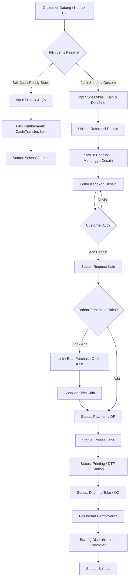
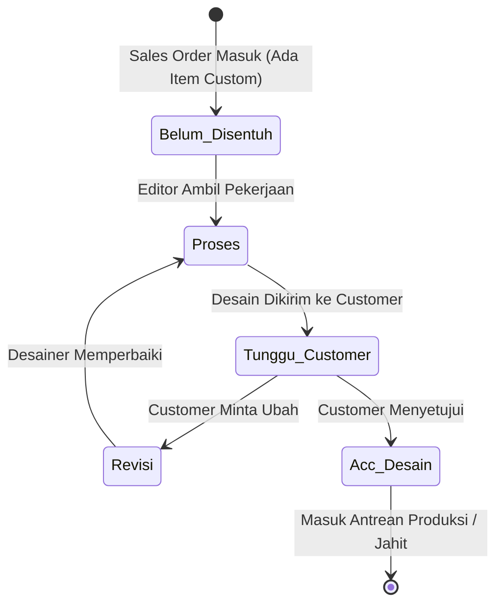
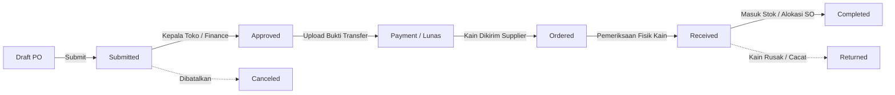
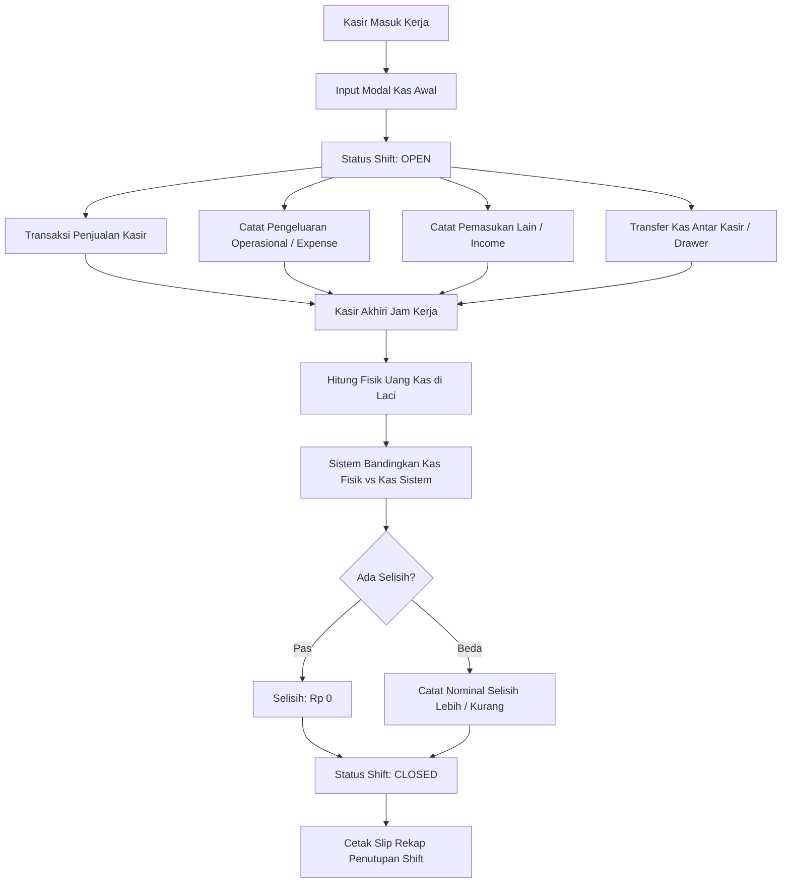

# 🧵 PARE CUSTOM — Point of Sale (POS), Inventory & Apparel Manufacturing ERP

> **Sistem Manajemen Terpadu Konveksi, DTF & Sablon Custom, Point of Sale (POS), Manajemen Shift Kasir, Inventori Stok, dan Workflow Desain berbasis Web dengan Multi-Role Access Control.**

[](https://laravel.com)
[](https://php.net)
[](https://tailwindcss.com)
[](https://mysql.com)
[](https://laravel-excel.com)
[](LICENSE)

---

## 📑 Daftar Isi

1. [Tentang Sistem Pare Custom](#-tentang-sistem-pare-custom)
2. [Solusi Bisnis & Fitur Unggulan](#-solusi-bisnis--fitur-unggulan)
3. [Arsitektur & Tech Stack](#-arsitektur--tech-stack)
4. [Matriks Peran & Hak Akses (5 Role)](#-matriks-peran--hak-akses-5-role)
5. [Diagram Alur Kerja Sistem (Business Workflow)](#-diagram-alur-kerja-sistem-business-workflow)
   - [A. Alur Pesanan Penjualan (Sales Order Workflow)](#a-alur-pesanan-penjualan-sales-order-workflow)
   - [B. Alur Antrean & Pengerjaan Desain (Design Task Workflow)](#b-alur-antrean--pengerjaan-desain-design-task-workflow)
   - [C. Alur Pengadaan Bahan & Kain (Purchase Order Workflow)](#c-alur-pengadaan-bahan--kain-purchase-order-workflow)
   - [D. Alur Kasir & Siklus Shift Kerja (Shift Lifecycle)](#d-alur-kasir--siklus-shift-kerja-shift-lifecycle)
6. [Panduan Lengkap Penggunaan Per Menu](#-panduan-lengkap-penggunaan-per-menu)
   - [1. Dashboard Eksekutif & Monitoring](#1-dashboard-eksekutif--monitoring)
   - [2. Sales Orders (Penjualan & Kasir)](#2-sales-orders-penjualan--kasir)
   - [3. Purchase Orders (Pembelian Bahan & Supplier)](#3-purchase-orders-pembelian-bahan--supplier)
   - [4. Inventory (Manajemen Stok & Gudang)](#4-inventory-manajemen-stok--gudang)
   - [5. Shift Kasir & Cash Drawer](#5-shift-kasir--cash-drawer)
   - [6. Performa Iklan (Advertisement Tracking)](#6-performa-iklan-advertisement-tracking)
   - [7. Master Produk & Kategori](#7-master-produk--kategori)
   - [8. Manajemen Kontak (Customer & Supplier)](#8-manajemen-kontak-customer--supplier)
   - [9. Manajemen Pengguna & Keamanan](#9-manajemen-pengguna--keamanan)
7. [Skema Basis Data (Database Models)](#-skema-basis-data-database-models)
8. [Panduan Instalasi Lokal (Quick Start)](#-panduan-instalasi-lokal-quick-start)
9. [Konfigurasi Environment (.env)](#-konfigurasi-environment-env)
10. [Panduan Deployment ke Hosting / VPS](#-panduan-deployment-ke-hosting--vps)
11. [Troubleshooting & Solusi Kendala](#-troubleshooting--solusi-kendala)

---

## 💡 Tentang Sistem Pare Custom

**Pare Custom** adalah platform operasional terpadu (ERP + POS) yang dibangun khusus untuk bisnis manufaktur konveksi, pakaian kustom (kaos, jersey, polo, jaket, kemeja), sablon manual/digital, dan percetakan DTF (*Direct-to-Film*).

Bisnis konveksi memiliki kompleksitas unik yang tidak bisa diakomodasi oleh aplikasi kasir ritel biasa:
* **Dua Model Bisnis**: Menjual barang jadi ready-stock (`beli_jadi`) dan pesanan *make-to-order* / jahit dari gulungan kain (`jahit_sendiri`).
* **Ketergantungan Desain**: Barang tidak boleh masuk antrean potong/jahit sebelum desain disetujui (*Acc Desain*) oleh pembeli.
* **Pembelian Bahan Berbasis Order**: Pembelian kain atau bahan mentah seringkali ditautkan (*linked*) langsung ke nomor pesanan konsumen tertentu.
* **Pembayaran Bertahap**: Pembayaran uang muka (DP), pelunasan bertahap, dan metode split (*Cash* + *Transfer Bank*).
* **Perhitungan Laba Kotor & HPP Akurat**: HPP snapshot per barang untuk memastikan margin keuntungan setiap transaksi terukur secara real-time.

---

## 🚀 Solusi Bisnis & Fitur Unggulan

### 1. Sistem Penjualan Cerdas (Dual-Type Sales Order)
* **Mode Beli Jadi**: Untuk produk siap pakai langsung bawa pulang.
* **Mode Jahit Sendiri**: Untuk apparel custom dengan spesifikasi kain, pola jahit, deadline pengerjaan, dan tautan ke Purchase Order kain.

### 2. Kanban Antrean Desain (Editor Desk)
* Desainer grafis memiliki dashboard sendiri untuk memantau pesanan yang butuh dibuatkan mock-up/desain.
* Pelacakan *Design Aging* (menghitung berapa lama pesanan tertahan di fase desain agar tidak terjadi komplain keterlambatan).
* Status desain transparan: `Belum Disentuh`, `Proses Desain`, `Tunggu Respon Customer`, `Revisi`, dan `Acc Desain`.

### 3. Proteksi Shift Kasir Anti-Kebocoran (*Shift Blocking System*)
* Kasir **wajib membuka shift** dan menginput modal kas fisik sebelum dapat memproses transaksi penjualan.
* Pencatatan arus kas masuk (*Income*), pengeluaran operasional warung/toko (*Expense*), dan serah terima transfer kas (*Cash Transfer*).
* Tutup Shift (*End Shift*) dengan validasi hitungan uang fisik vs sistem. Sistem otomatis menghitung ada tidaknya selisih (*selisih lebih* / *selisih kurang*).
* Fitur **Approval Shift Auto-Close** oleh Finance jika kasir lupa menutup shift melewati jam operasional.

### 4. Akuntansi & Manajemen HPP (Finance Hub)
* Snapshot harga modal (*Cost Price*) saat transaksi terjadi, menjamin kalkulasi HPP masa lalu tidak berubah meskipun master produk mengalami fluktuasi harga modal.
* Menghitung **Estimasi Gross Profit** (`Grand Total - Total HPP`) per transaksi secara otomatis.
* **Export Excel Mutakhir**: Format multi-item rapi di mana kolom total transaksi (`GRAND_TOTAL`, `SUBTOTAL`, `STATUS`, `TOTAL_HPP`, `EST_PROFIT`, `TOTAL_DIBAYAR`, `SISA`) hanya muncul satu kali per nomor SO, sehingga tim finance bebas melakukan formula `=SUM()` di Excel tanpa khawatir terjadi duplikasi angka (*double counting*).

### 5. Log Perubahan Harga Produk (Price Audit Trail)
* Setiap perubahan harga jual maupun harga modal (HPP) produk dicatat di tabel audit log (`product_price_logs`) lengkap dengan nama user, timestamp, dan jenis perubahannya.
* Fitur Import Update Harga Massal via Excel dengan fasilitas *Preview Enriched* sebelum disimpan ke database.

### 6. Pelacakan Biaya Iklan (Advertisement Performance)
* Pencatatan biaya iklan digital harian (Meta Ads, TikTok Ads, Google).
* Menghitung efektivitas iklan terhadap omset yang masuk (ROAS & Cost per Acquisition).

---

## 🛠 Arsitektur & Tech Stack

| Komponen | Teknologi | Keterangan |
| :--- | :--- | :--- |
| **Framework** | Laravel 11.x | PHP Web Framework dengan arsitektur MVC |
| **Bahasa Pemrograman** | PHP 8.2 / 8.3 | Strong Typing, Match Expressions, Property Hooks |
| **Database** | MySQL 8.0 / MariaDB | Relasional dengan Indexing Performa Tinggi |
| **Frontend Templating**| Blade Template | Server-Side Rendering yang cepat dan SEO-friendly |
| **Styling & CSS** | Tailwind CSS 3.x | Utility-first CSS dengan custom responsive layout |
| **Typography & Icons** | Raleway & Bootstrap Icons | Tipografi modern elegan dan icon set lengkap |
| **Spreadsheet Engine** | Maatwebsite/Excel 3.1 | Export & Import file `.xlsx` berbasis chunk |
| **PDF Generation** | DomPDF (Barryvdh) | Cetak Nota Thermal, Surat Jalan & Rekap Shift |
| **Web Server** | Nginx / Apache | Reverse Proxy, FastCGI, SSL HTTPS |

---

## 👥 Matriks Peran & Hak Akses (5 Role)

Aplikasi memiliki 5 tingkatan pengguna (*usertype*) dengan batas wewenang yang terisolasi secara ketat via middleware:

```
                  ┌─────────────────────────────────────┐
                  │            👑 OWNER                 │
                  │   Super Admin & Full Access Priv.   │
                  └──────────────────┬──────────────────┘
                                     │
         ┌───────────────────────────┼───────────────────────────┐
         │                           │                           │
┌────────▼────────┐         ┌────────▼────────┐         ┌────────▼────────┐
│   💰 FINANCE    │         │ 🏪 KEPALA TOKO  │         │   🎨 EDITOR     │
│ Uang, HPP, Rekap│         │ Operasional Toko│         │ Desain & Mockup │
└────────┬────────┘         └────────┬────────┘         └─────────────────┘
         │                           │
         └─────────────┬─────────────┘
                       │
              ┌────────▼────────┐
              │    🛒 ADMIN     │
              │  Kasir & Front  │
              └─────────────────┘
```

### Matriks Komparasi Hak Akses Fitur:

| Fitur / Modul | Owner | Finance | Kepala Toko | Admin | Editor |
| :--- | :---: | :---: | :---: | :---: | :---: |
| **Dashboard Finansial & Grafik Omset** | ✅ Full | ✅ Full | ✅ Toko | ⚠️ Terbatas | ❌ |
| **Buka & Tutup Shift Kasir Sendiri** | ✅ | ❌ | ✅ | ✅ | ❌ |
| **Approval Auto-Close Shift Tertinggal** | ✅ | ✅ | ❌ | ❌ | ❌ |
| **Buat & Edit Sales Order (Jahit / Beli Jadi)** | ✅ | ✅ | ✅ | ✅ | ❌ |
| **Akses Antrean & Update Status Desain** | ✅ | ❌ | ❌ | ❌ | ✅ Full |
| **Input Pembayaran (Cash, Transfer, Split)** | ✅ | ✅ | ✅ | ✅ | ❌ |
| **Koreksi / Hapus Transaksi Pembayaran** | ✅ | ✅ | ✅ | ❌ | ❌ |
| **Update Harga Modal (HPP) di Transaksi** | ✅ | ✅ | ❌ | ❌ | ❌ |
| **Buat & Edit Purchase Order (Bahan Kain)** | ✅ | ✅ | ✅ | ✅ | ⚠️ Terbatas |
| **Approve & Bayar Purchase Order** | ✅ | ✅ | ✅ | ❌ | ❌ |
| **Rollback Status & Hapus Purchase Order** | ✅ | ❌ | ❌ | ❌ | ❌ |
| **Stock Opname (Input Fisik Stok)** | ✅ | ⚠️ Read | ✅ | ✅ | ⚠️ Draft |
| **Approval & Adjust Selisih Stock Opname** | ✅ | ✅ | ✅ | ❌ | ❌ |
| **Manajemen Master Produk & Kategori** | ✅ | ✅ | ✅ | ✅ | ⚠️ Read |
| **Import Massal Perubahan Harga Modal** | ✅ | ✅ | ❌ | ✅ | ❌ |
| **Input Biaya Iklan (Advertisement)** | ✅ | ❌ | ✅ | ✅ | ❌ |
| **Manajemen User / Akun Karyawan** | ✅ | ❌ | ❌ | ❌ | ❌ |

---

## 🔄 Diagram Alur Kerja Sistem (Business Workflow)

### A. Alur Pesanan Penjualan (Sales Order Workflow)



### B. Alur Antrean & Pengerjaan Desain (Design Task Workflow)



### C. Alur Pengadaan Bahan & Kain (Purchase Order Workflow)



### D. Alur Kasir & Siklus Shift Kerja (Shift Lifecycle)



---

## 📖 Panduan Lengkap Penggunaan Per Menu

### 1. Dashboard Eksekutif & Monitoring
* **Tujuan**: Memberikan pandangan helikopter (*helicopter view*) terhadap kesehatan finansial, omset harian, beban modal (HPP), dan status operasional.
* **Fitur Utama**:
  * **Card Total Omset**: Total akumulasi penjualan berdasarkan rentang tanggal filter.
  * **Card Total HPP**: Total modal pokok penjualan (`Σ HPP item produk × qty`).
  * **Card Estimasi Laba Bersih**: Margin kotor keuntungan toko (`Omset - HPP`).
  * **Card Pengeluaran Operasional**: Rekapitulasi pengeluaran kasir/toko.
  * **Widget Antrean Pesanan**: Menampilkan pesanan yang mendekati deadline (H-3 dan Overdue).

### 2. Sales Orders (Penjualan & Kasir)
* **Tujuan**: Mengelola seluruh transaksi penjualan ritel maupun custom order dari awal hingga barang diterima customer.
* **Fitur Utama**:
  * **Buat SO Baru**: Form multi-item interaktif dengan pencarian cepat produk via AJAX, input diskon per order, ongkos kirim, dan kalkulator bayar kembalian.
  * **Manajemen Pembayaran**:
    * Pilihan metode: *Cash*, *Transfer Bank*, atau *Split Payment*.
    * Dukungan DP (Down Payment) dan riwayat pelunasan bertahap.
    * Upload bukti struk/mutasi transfer bank.
  * **Cetak Struk Thermal & Nota**: Cetak nota ukuran 58mm/80mm atau format surat jalan A4.
  * **Tautan Pengadaan (Link to PO)**: Menautkan pesanan custom ke PO kain supplier secara otomatis.
  * **Export Excel Keuangan**: Export rekapitulasi data penjualan bebas duplikasi kolom order (sangat disukai tim akuntansi).

### 3. Purchase Orders (Pembelian Bahan & Supplier)
* **Tujuan**: Mengontrol proses pengadaan bahan baku kain, benang, sablon, atau apparel polosan dari vendor.
* **Fitur Utama**:
  * **Workflow Pengadaan Bertingkat**: Dari pengajuan draft, persetujuan atasan (*approve*), pembayaran kas/transfer, pelacakan pengiriman, hingga penerimaan fisik barang.
  * **Upload Invoice & Bukti Bayar**: Arsip digital faktur supplier.
  * **Retur Pembelian (Purchase Return)**: Pencatatan pengembalian kain cacat/rusak ke vendor.
  * **Rollback Status**: Fitur khusus Owner untuk mengembalikan status transaksi jika terjadi kesalahan input penerimaan barang.

### 4. Inventory (Manajemen Stok & Gudang)
* **Tujuan**: Menjamin akurasi jumlah barang fisik di rak dengan data sistem.
* **Fitur Utama**:
  * **Katalog Stok Real-Time**: Informasi kuantitas stok produk, nilai rupiah aset barang, dan peringatan *Low Stock Alert*.
  * **Stock Opname (Audit Fisik)**:
    * Download template Excel stock opname.
    * Input kuantitas hasil hitung fisik di lapangan.
    * Sistem otomatis menghitung selisih barang (*difference*).
    * Approval bertingkat untuk melakukan penyesuaian otomatis ke stok gudang.
  * **Kartu Mutasi Stok (Stock Movement)**: Riwayat lengkap setiap kali barang keluar (karena penjualan/penyesuaian) atau barang masuk (karena pembelian/retur).
  * **Stock Adjustment Manual**: Penyesuaian stok jika ditemukan barang rusak, hilang, atau sampling display.

### 5. Shift Kasir & Cash Drawer
* **Tujuan**: Mencegah kecurangan kasir, mengontrol laci uang fisik, dan memastikan setiap rupiah tercatat rapi.
* **Fitur Utama**:
  * **Buka Shift**: Kasir mencatat modal uang kembalian pertama kali.
  * **Petty Cash Expense**: Kasir mencatat pengeluaran kecil (misal: beli lakban, air galon, uang makan lembur).
  * **Penutupan Shift**: Kasir menghitung nominal uang lembaran dan koin di laci kasir.
  * **Cetak Slip Penutupan**: Struk rekapitulasi total penjualan tunai, non-tunai, pengeluaran, dan selisih kas.
  * **Auto-Close Approval**: Sistem mendeteksi shift yang lupa ditutup lebih dari 24 jam dan mengarahkan ke Finance untuk validasi nominal akhir.

### 6. Performa Iklan (Advertisement Tracking)
* **Tujuan**: Menghubungkan pengeluaran biaya marketing digital dengan omset penjualan nyata.
* **Fitur Utama**:
  * Input harian biaya iklan per platform (TikTok Ads, Meta Ads / Facebook & Instagram).
  * Menghitung rasio ROAS harian dan omset yang tercipta dari tim CS / Marketing.

### 7. Master Produk & Kategori
* **Tujuan**: Database pusat seluruh varian produk yang diproduksi atau dijual Pare Custom.
* **Fitur Utama**:
  * Manajemen Kategori Produk bertingkat.
  * Kode SKU unik dan dukungan Barcode Scanner.
  * Pengaturan Harga Jual dan Harga Modal Pokok (HPP).
  * **Import Massal Update Harga**: Kemudahan mengubah ribuan harga modal atau harga jual sekaligus menggunakan spreadsheet Excel dengan verifikasi preview sebelum commit.

### 8. Manajemen Kontak (Customer & Supplier)
* **Tujuan**: Direktori pelanggan setia dan pemasok kain/aksesori.
* **Fitur Utama**:
  * Database kontak, alamat pengiriman, nomor WhatsApp/telepon.
  * Template import dan export kontak via Excel.

### 9. Manajemen Pengguna & Keamanan
* **Tujuan**: Pengaturan akses akun karyawan toko.
* **Fitur Utama**:
  * Pembuatan akun pengguna baru dengan pemilihan peran (`owner`, `finance`, `kepala_toko`, `admin`, `editor`).
  * Enkripsi password menggunakan algoritma Bcrypt.
  * Profil akun & ganti kata sandi mandiri.

---

## 🗄 Skema Basis Data (Database Models)

Aplikasi memiliki lebih dari 25 tabel relasional yang terintegrasi:

| Nama Model | Tabel Terkait | Deskripsi Fungsional |
| :--- | :--- | :--- |
| `User` | `users` | Akun pengguna, usertype/role, password, status aktif |
| `Customer` | `customers` | Kontak data pelanggan |
| `Supplier` | `suppliers` | Kontak data pemasok / vendor kain |
| `Category` | `categories` | Kategori klasifikasi produk apparel |
| `Product` | `products` | Master barang, SKU, barcode, harga jual, cost price, stok |
| `ProductPriceLog` | `product_price_logs` | Audit trail riwayat fluktuasi harga jual & modal |
| `SalesOrder` | `sales_orders` | Header pesanan penjualan, customer, status, total, payment |
| `SalesOrderItem` | `sales_order_items` | Rincian barang pesanan, modal snapshot, task desain |
| `SalesOrderLog` | `sales_order_logs` | Catatan riwayat perubahan status Sales Order |
| `PurchaseOrder` | `purchase_orders` | Header pembelian bahan ke supplier, workflow status |
| `PurchaseOrderItem` | `purchase_order_items` | Rincian barang pembelian, cost price, qty |
| `PurchaseOrderLog` | `purchase_order_logs` | Catatan riwayat status Purchase Order |
| `PurchaseReturn` | `purchase_returns` | Retur pengembalian barang ke supplier |
| `Payment` | `payments` | Transaksi pembayaran uang (DP, pelunasan, split) |
| `Shift` | `shifts` | Sesi kerja kasir, modal kas, rekonsiliasi selisih uang |
| `ShiftAutoClose` | `shift_auto_closes` | Antrean persetujuan penutupan shift otomatis |
| `Income` | `incomes` | Pemasukan non-penjualan di shift berjalan |
| `Expense` | `expenses` | Biaya pengeluaran operasional di shift berjalan |
| `CashTransfer` | `cash_transfers` | Transfer uang kas antar laci kasir |
| `StockIn` | `stock_ins` | Dokumen penerimaan barang masuk ke gudang |
| `StockOpname` | `stock_opnames` | Dokumen audit fisik inventori berkala |
| `StockOpnameItem` | `stock_opname_items` | Detail selisih fisik vs sistem per SKU |
| `StockAdjustment` | `stock_adjustments` | Dokumen penyesuaian koreksi stok |
| `StockMovement` | `stock_movements` | Kartu stok log arus keluar-masuk barang |
| `AdvertisementPerformance` | `advertisement_performances` | Laporan biaya & metrik iklan harian |
| `NumberSequence` | `number_sequences` | Generator penomoran unik otomatis (SO, PO, dll) |

---

## 💻 Panduan Instalasi Lokal (Quick Start)

### Prasyarat Sistem:
* **PHP**: Versi `8.2` atau `8.3` (ekstensi wajib: `pdo_mysql`, `mbstring`, `openssl`, `gd`, `zip`, `xml`, `curl`).
* **Composer**: Versi `2.x`.
* **Database**: MySQL `8.0+` atau MariaDB `10.4+`.
* **Web Server**: Laragon, XAMPP, atau Laravel Herd.

### Langkah-langkah Instalasi:

1. **Clone Repositori:**
   ```bash
   git clone https://github.com/suksesdigitalmedia11-gif/Pare-Custom.git
   cd Pare-Custom
   ```

2. **Instal Dependensi PHP:**
   ```bash
   composer install
   ```

3. **Duplikasi Konfigurasi Environment:**
   ```bash
   cp .env.example .env
   ```

4. **Generate Application Key:**
   ```bash
   php artisan key:generate
   ```

5. **Konfigurasi Database pada File `.env`:**
   Buka file `.env` dan sesuaikan kredensial database lokal Anda:
   ```ini
   DB_CONNECTION=mysql
   DB_HOST=127.0.0.1
   DB_PORT=3306
   DB_DATABASE=parecustom_db
   DB_USERNAME=root
   DB_PASSWORD=
   ```

6. **Jalankan Migrasi & Database Seeder:**
   ```bash
   php artisan migrate --seed
   ```

7. **Buat Symlink Penyimpanan Publik (Upload Bukti & Desain):**
   ```bash
   php artisan storage:link
   ```

8. **Jalankan Web Server Lokal:**
   ```bash
   php artisan serve
   ```
   Aplikasi dapat diakses melalui browser di: `http://127.0.0.1:8000`

---

## ⚙️ Konfigurasi Environment (.env)

Daftar variabel penting yang wajib diperhatikan:

```ini
APP_NAME="Pare Custom"
APP_ENV=production
APP_KEY=base64:...
APP_DEBUG=false
APP_URL=https://parecustom.com

# Pengaturan Basis Data
DB_CONNECTION=mysql
DB_HOST=127.0.0.1
DB_PORT=3306
DB_DATABASE=u150456332_parecustom_app
DB_USERNAME=u150456332_parecustom
DB_PASSWORD=...

# Pengaturan Session & Cookie
SESSION_DRIVER=file
SESSION_LIFETIME=120
SESSION_SECURE_COOKIE=true

# Pengaturan File System & Storage
FILESYSTEM_DISK=public
```

---

## 🌐 Panduan Deployment ke Hosting / VPS

Proyek ini telah dikonfigurasi dan berjalan optimal pada shared hosting (Hostinger / cPanel) maupun VPS Linux:

1. **Struktur Folder Hosting:**
   * Masuk melalui SSH:
     ```bash
     ssh -p [PORT] user@host
     ```
   * Direktori web: `/home/[USER]/domains/parecustom.com/public_html`
2. **Pengaturan Symlink Storage di Hosting:**
   Jika symlink belum aktif, jalankan via SSH di root project:
   ```bash
   php artisan storage:link
   ```
3. **Pembersihan Cache Berkala (Saat Rilis Fitur Baru):**
   ```bash
   php artisan optimize:clear
   php artisan config:cache
   php artisan route:cache
   php artisan view:cache
   ```
4. **Izin Akses Folder (File Permissions):**
   Pastikan folder `storage` dan `bootstrap/cache` memiliki izin tulis (*writable*):
   ```bash
   chmod -R 775 storage bootstrap/cache
   ```

---

## ❓ Troubleshooting & Solusi Kendala

| Gejala Masalah | Penyebab | Solusi |
| :--- | :--- | :--- |
| **Error 403 / "Action Blocked by Shift"** | Pengguna mencoba membuat transaksi tanpa ada sesi shift yang aktif. | Buka menu **Shift**, klik **Buka Shift Baru**, dan input modal kas awal. |
| **Gambar bukti bayar / mock-up tidak tampil (404)** | Symlink `public/storage` ke folder `storage/app/public` terputus. | Jalankan perintah `php artisan storage:link`. |
| **Error saat download Export Excel** | Relasi query N+1 overload atau batas memory PHP terlampaui. | Pastikan `payments` ter-eager load dan memory limit PHP diset minimal 256MB. |
| **Data tampilan lama masih muncul setelah update kode** | Cache route/view Blade masih tersimpan di server. | Jalankan `php artisan optimize:clear` melalui terminal atau SSH. |

---

<p align="center">
  <b>© 2026 Sukses Digital Lab — Pare Custom Apparel POS & ERP Platform.</b><br>
  <i>Dirancang untuk efisiensi, akurasi finansial, dan stabilitas operasional konveksi modern.</i>
</p>
